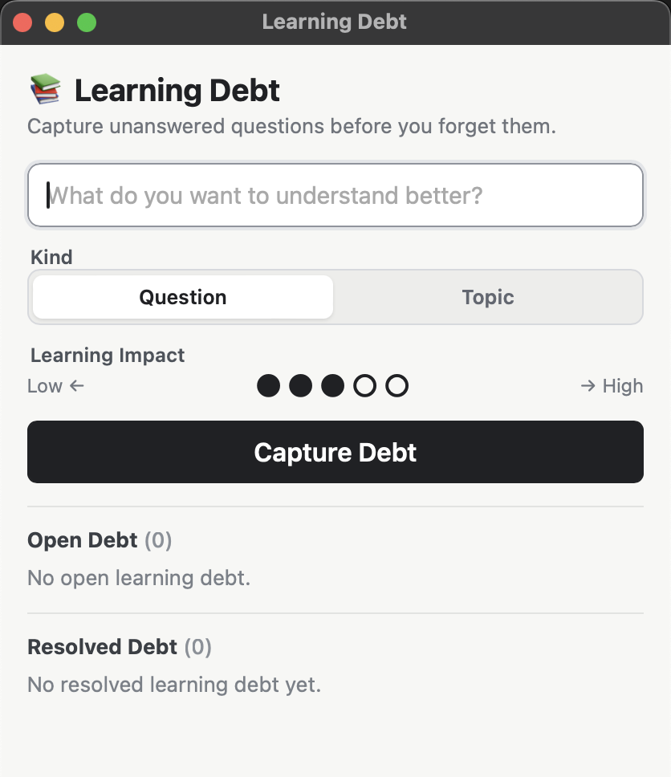
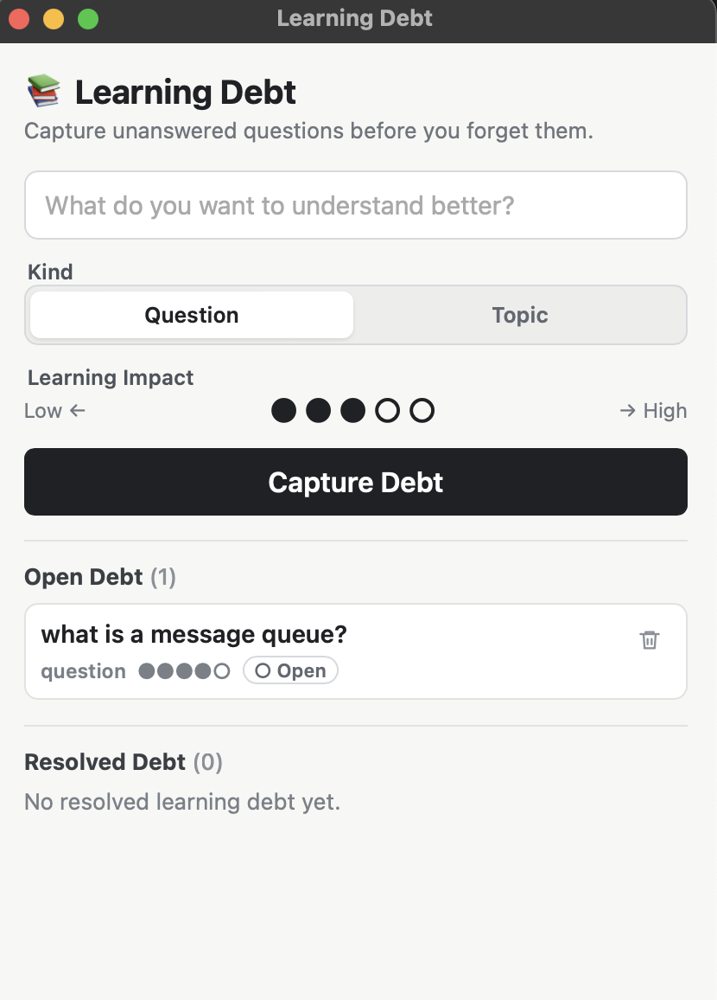
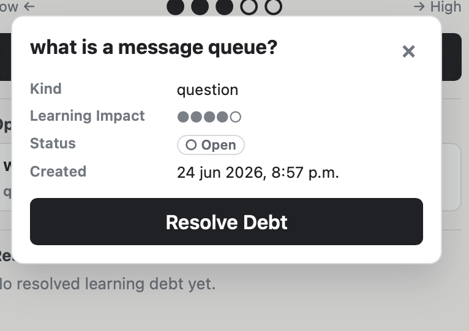
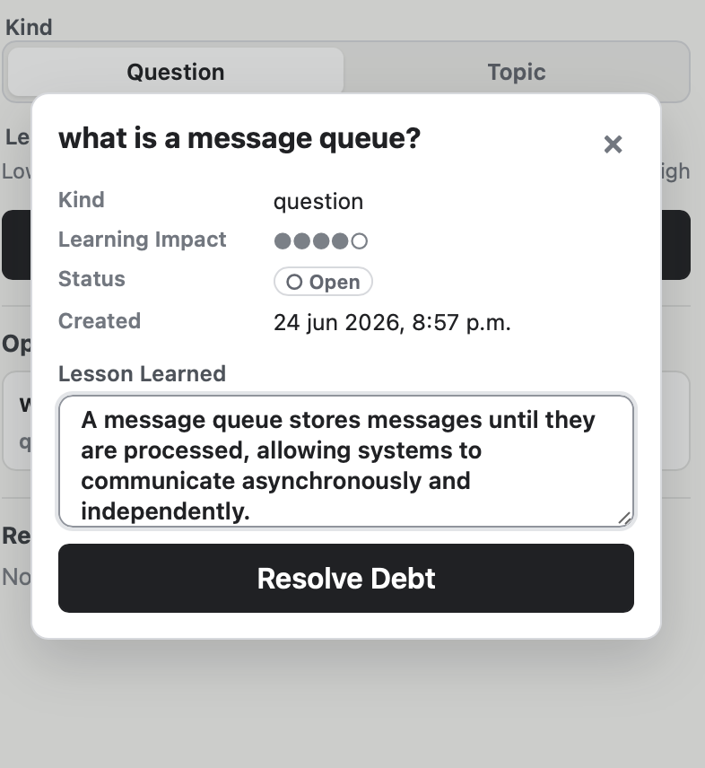
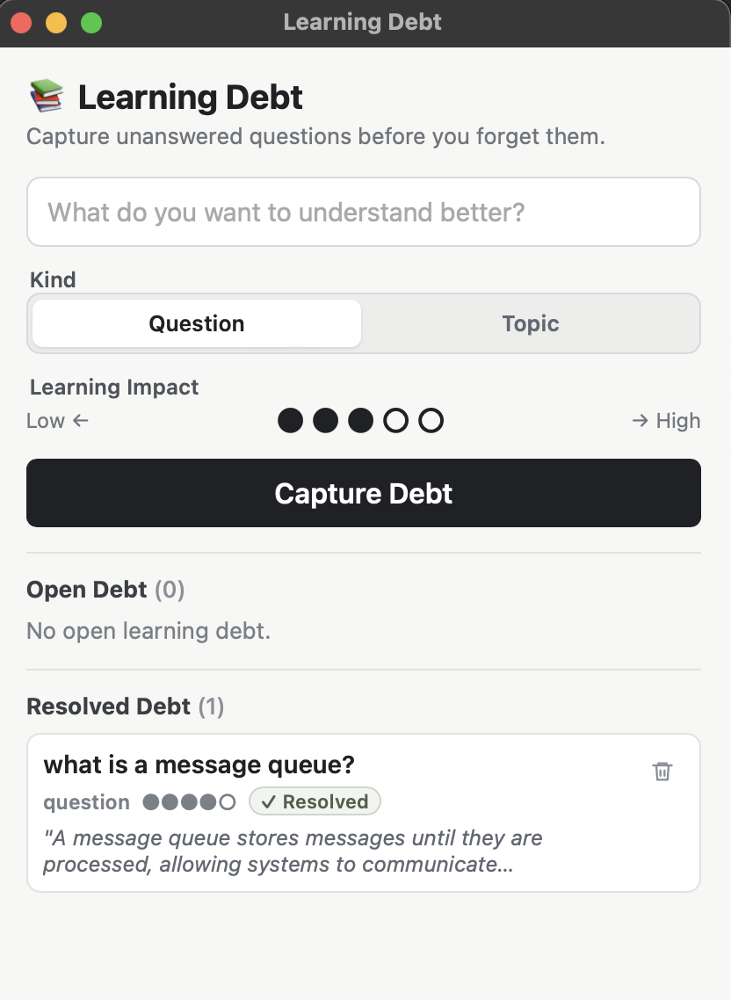
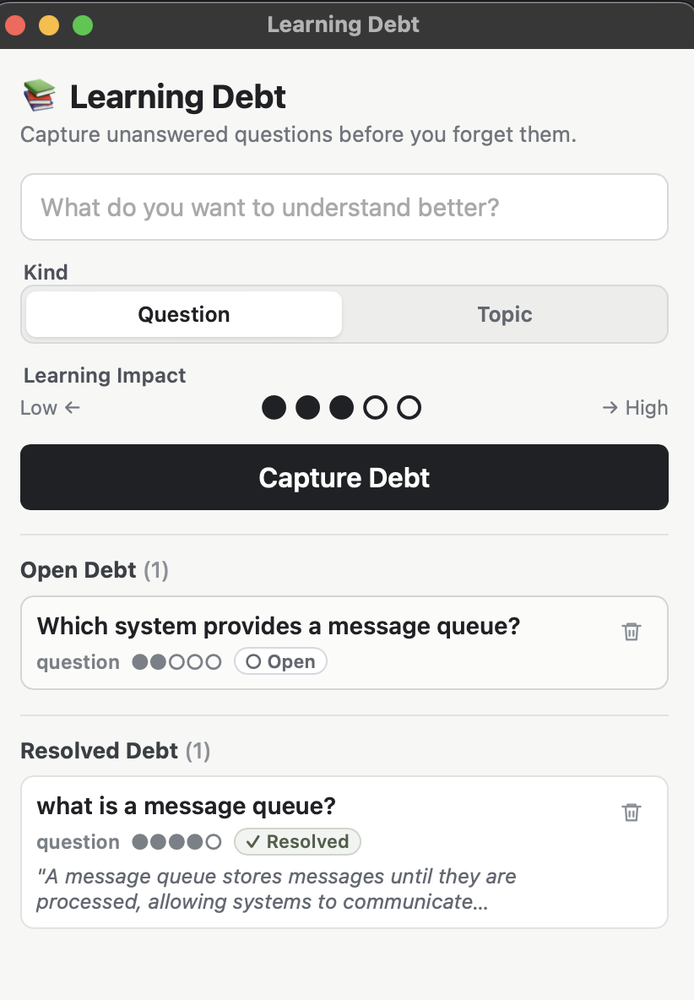

# Learning Debt

**Capture learning debt before you forget it.**

Learning Debt is a local-first desktop app that helps developers capture unanswered technical questions and turn them into lessons learned.


## What is Learning Debt?

While building software, developers often postpone questions: Why does this API behave that way? What should I understand better about this pattern? Those unanswered questions become learning debt.

Learning Debt helps you capture those questions quickly, revisit them later, and resolve them with a short lesson learned.

## Why use it?

- Capture technical questions quickly.
- Prioritize by learning impact.
- Track open learning debt.
- Resolve questions into lessons learned.
- Store everything locally with SQLite.
- Work fully offline.

## How it works

### Capture

Capture a question or topic.



### Track

Track open learning debt.



### Resolve

Open a debt item and resolve it.



Write a short lesson learned before resolving.



### Learn

Save a lesson learned for future reference.



Open and resolved debt stay visible in separate sections.



## Features

- Local-first desktop app.
- SQLite persistence.
- Open / Resolved lifecycle.
- Lesson Learned when resolving debt.
- Learning Impact rating.
- Delete items.
- Tests with Vitest and React Testing Library.

## Tech Stack

- Tauri v2
- React
- TypeScript
- SQLite
- Vitest
- React Testing Library

## Getting Started

### Requirements

- Node.js 18+ and npm
- Rust and Cargo
- Tauri system dependencies for your operating system

Official Tauri prerequisites:

```text
https://v2.tauri.app/start/prerequisites/
```

### Setup

Run the onboarding script:

```sh
npm run setup
```

The setup script checks your local toolchain, installs JavaScript dependencies, and runs the frontend tests.

### Run locally

Start the desktop app:

```sh
npm run tauri dev
```

Run only the web UI:

```sh
npm run dev
```

### Run tests

```sh
npm test
```

### Build

Build the frontend:

```sh
npm run build
```

Build the desktop app:

```sh
npm run tauri build
```

## Local Data

Learning Debt stores captured items locally in SQLite through the Tauri SQL plugin.

Database name:

```text
learning-debt.db
```

On macOS during development, the database is stored at:

```sh
~/Library/Application Support/com.learningdebt.app/learning-debt.db
```

Database files are intentionally ignored by Git.

## Cross-platform testing

Learning Debt is intended to work on macOS, Windows, and Linux.

macOS has been tested during development. Windows and Linux feedback is welcome. If setup fails on your platform, please open an issue or pull request with the OS version, command output, and any missing system dependencies.

### macOS

- Install Xcode Command Line Tools if the Tauri build fails:

```sh
xcode-select --install
```

### Windows

- Install Node.js 18+.
- Install Rust with rustup.
- Install Microsoft C++ Build Tools.
- Ensure WebView2 is available.
- Run commands from PowerShell, Command Prompt, or a terminal configured for Rust.

### Linux

- Install Node.js 18+.
- Install Rust with rustup.
- Install the WebKitGTK and build dependencies required by Tauri for your distribution.
- Package names vary by distro, so use the Tauri prerequisites page as the source of truth.

Debian/Ubuntu example:

```sh
sudo apt install libwebkit2gtk-4.1-dev build-essential curl wget file libxdo-dev libssl-dev libayatana-appindicator3-dev librsvg2-dev
```

## Current Limitations

- No sync.
- No authentication.
- No cloud backend.
- No search or filters.
- No edit flow for existing items.
- No archive or trash recovery.
- No CI or release automation yet.
- Tests currently cover core React behavior, not real SQLite or Tauri desktop integration.

## Roadmap

- Windows compatibility testing.
- Linux compatibility testing.
- Global shortcut.
- Reflection dashboard.
- GitHub Actions builds.
- Release artifacts.

## License

MIT License. See [LICENSE](LICENSE).
